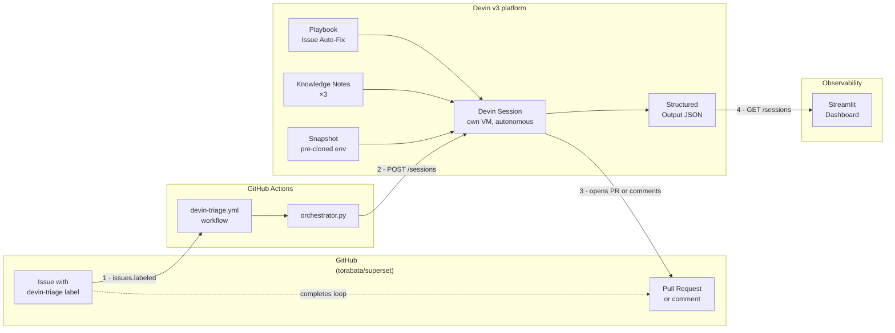
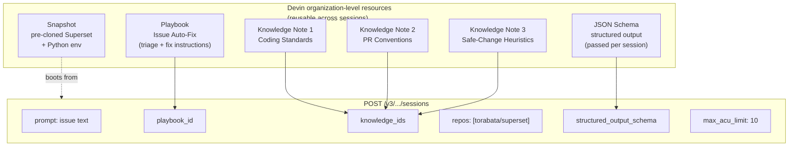
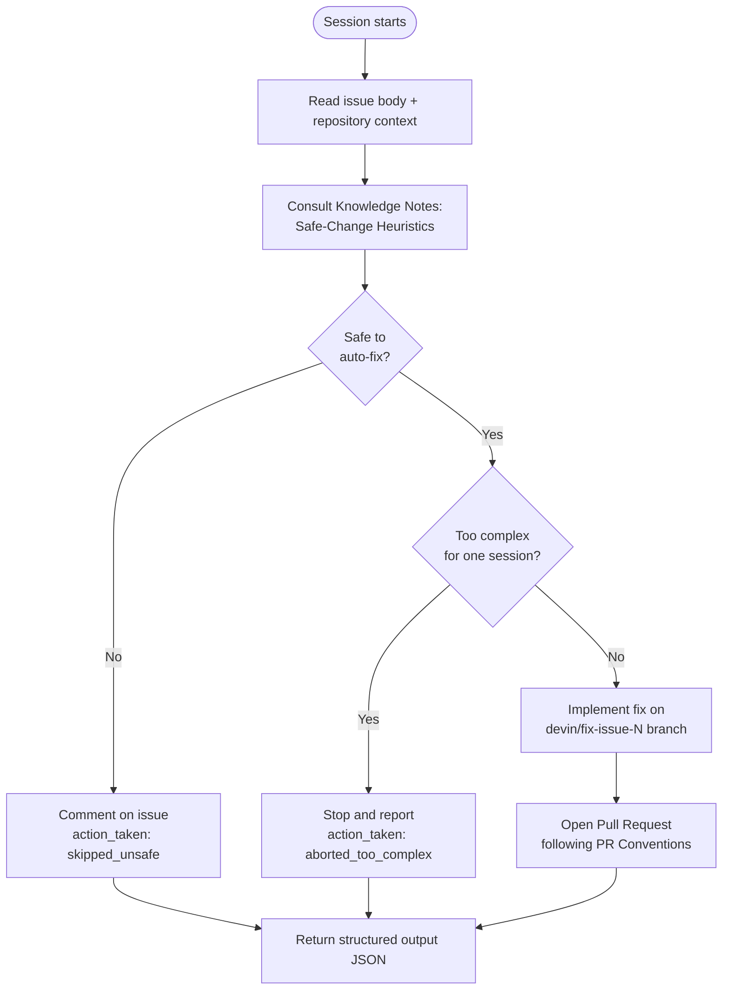

# Architecture — GitHub Issue Triage Agent

## 1. End-to-end flow

**Numbered steps**:
1. Engineer (or scanner) labels issue → GitHub fires `issues.labeled`.
2. Orchestrator calls Devin v3 API with playbook, knowledge, repos, schema.
3. Devin works autonomously and emits artifacts back to GitHub (PR or comment).
4. Dashboard pulls structured output from Devin to render live metrics.

---

## 2. What we configure on the Devin side (deep dive)

**Key idea**: org-level resources (Playbook + 3 Knowledge Notes + Snapshot) are
authored once and reused across every session. Each new issue triggers a
session that reuses the same standardised behavior.

---

## 3. Decision logic inside one session

The agent self-limits. Three possible outcomes:
- `pr_opened` — safe and tractable
- `skipped_unsafe` — touches security / auth / migrations / production hot paths
- `aborted_too_complex` — would require human design decisions

---

## 4. Why this leverages Devin (not just calls an LLM)

| Capability | What it does | Why it matters here |
|---|---|---|
| **Playbook** | Reusable instruction set stored on Devin | Triage logic versioned and shared, not per-prompt |
| **Knowledge Notes ×3** | Auto-attached when triggers match | Org rules apply automatically — no prompt rewriting |
| **Snapshot Setup (Blueprint)** | Pre-built repo + dependencies | Sessions boot in seconds, not minutes |
| **`repos` parameter** | Repo declared at session-create time | Working tree is ready instantly |
| **`structured_output_schema`** | Forces JSON-validated response | Every decision is auditable and feeds the dashboard |
| **`max_acu_limit`** | Per-session cost cap | Hard ceiling against runaway agents |
| **`tags`** | Issue-id tagging | Traceability, downstream filtering |

---

## 5. Why GitHub Actions, not a separate service

| | Self-hosted server | **GitHub Actions** |
|---|---|---|
| Infrastructure to run | Always-on host required | Zero — GitHub runs it |
| Trigger latency | Polling delay (30–60s) | Immediate (event-fire) |
| Operating cost | Server cost | Free tier covers this load |
| Reliability | We own uptime | GitHub manages uptime |
| Demo simplicity | Hosting + Docker + DNS | Commit a single YAML file |

---

## 6. Things deliberately NOT in the system

| Thing | Why we left it out |
|---|---|
| **Multi-stage agent chaining (Devin → Devin)** | Knowledge Notes already encode the safety judgment. Single session is simpler to demo and cheaper to run. The architecture supports adding a reviewer-Devin via `child_playbook_id` later. |
| **Webhook + ngrok / public endpoint** | GitHub Actions already responds to events natively. |
| **External database** | Structured output is fetched on demand from Devin. For production we'd persist into Postgres + the same dashboard. |
| **Custom UI for issue creation** | A test helper (`tests/test_dispatch.py`) creates issues via the GitHub API. Engineers use GitHub's native issue UI. |
